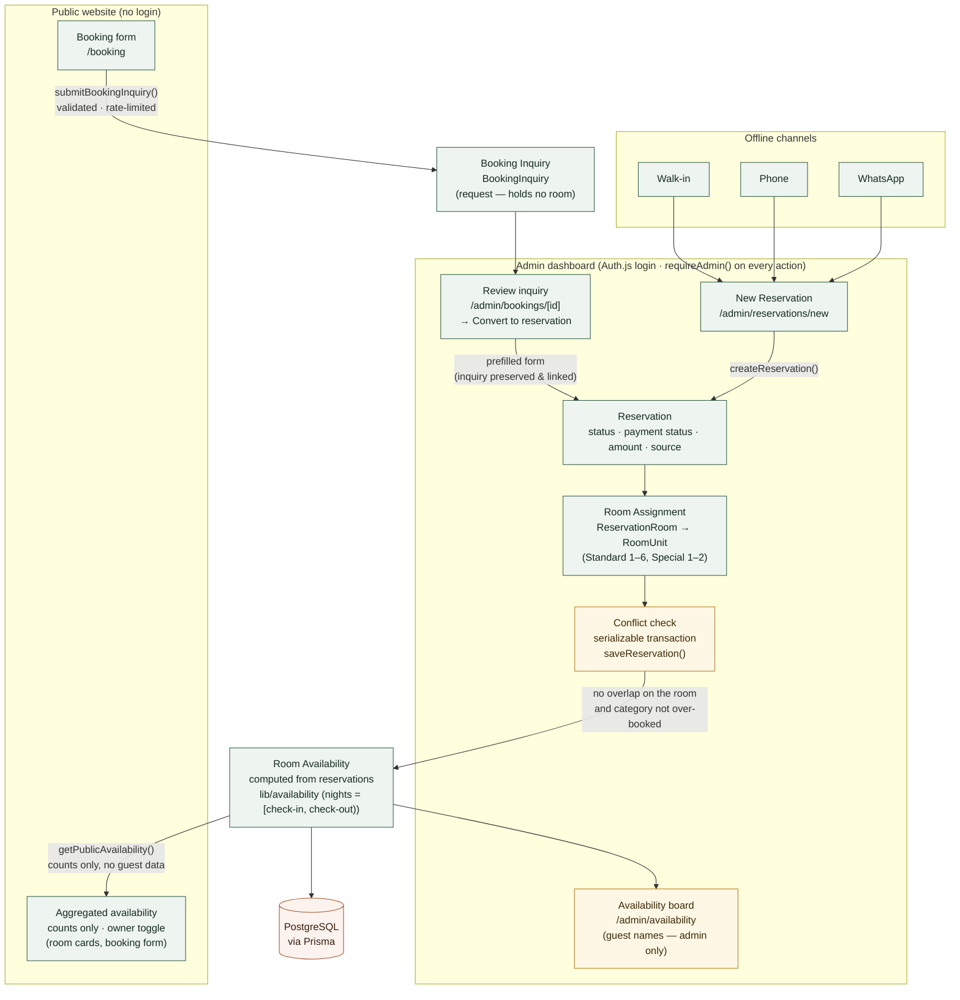
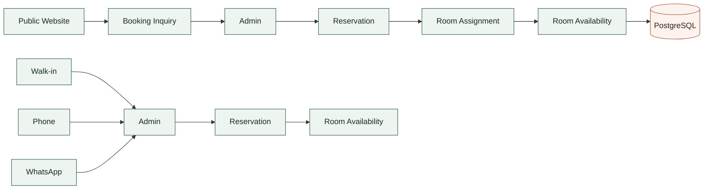
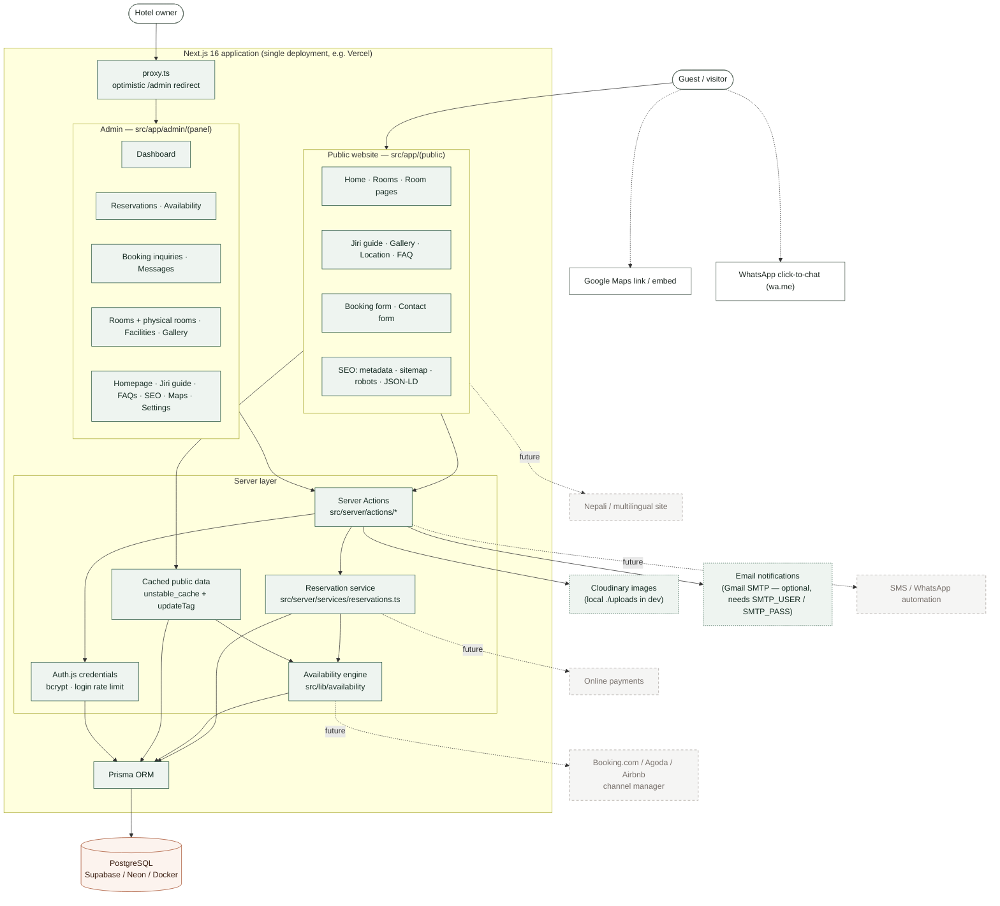
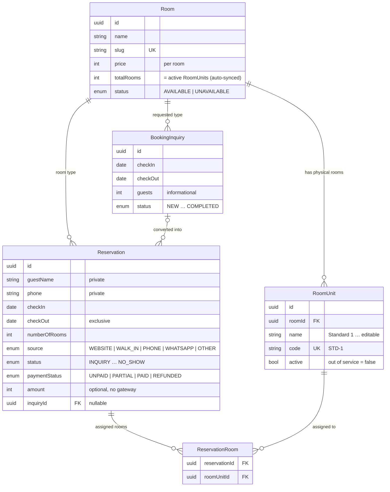

# Lama Hotel & Lodge — Architecture

> Generated by analysing the current repository (October 2026). Every **solid** box exists in the code;
> **dashed grey** boxes are possible future integrations that are **not implemented**.
> Rendered SVGs of each diagram are in this folder (`*.svg`).

One Next.js 16 application (monolith) — public website and admin dashboard share the same server,
Prisma client and PostgreSQL database.

## 1. Reservation flow (implemented)

## 2. Required flows (simplified)

## 3. System overview — implemented vs future

## 4. Data model (reservation-related)

## Key rules (as implemented)

| Rule | Where |
|---|---|
| A stay occupies nights `[checkIn, checkOut)` — 10→12 June frees the room for 12 June | `src/lib/availability/core.ts` (`eachNight`, `overlaps`) |
| Rooms are held by `PENDING`, `CONFIRMED`, `CHECKED_IN`, `CHECKED_OUT`; never by `INQUIRY`, `CANCELLED`, `NO_SHOW` | `OCCUPYING_STATUSES` |
| Early check-out moves `checkOut` to today, freeing the remaining nights | `changeReservationStatus()` |
| One occupying reservation per physical room per night; a room type can't exceed its active rooms | `findConflicts()` inside a **serializable** transaction in `saveReservation()` |
| Category inventory = number of active physical rooms (auto-synced) | `syncRoomTotals()`, room-unit actions, backfill migration |
| Public availability = counts per room type only, behind an owner toggle (off by default) | `src/lib/data/availability.ts` |
| Guest data only in authenticated admin pages (layout + every action call `requireAdmin()`; `/admin` is `noindex` and disallowed in robots.txt) | `src/lib/auth.ts`, `next.config.ts`, `src/app/robots.ts` |
